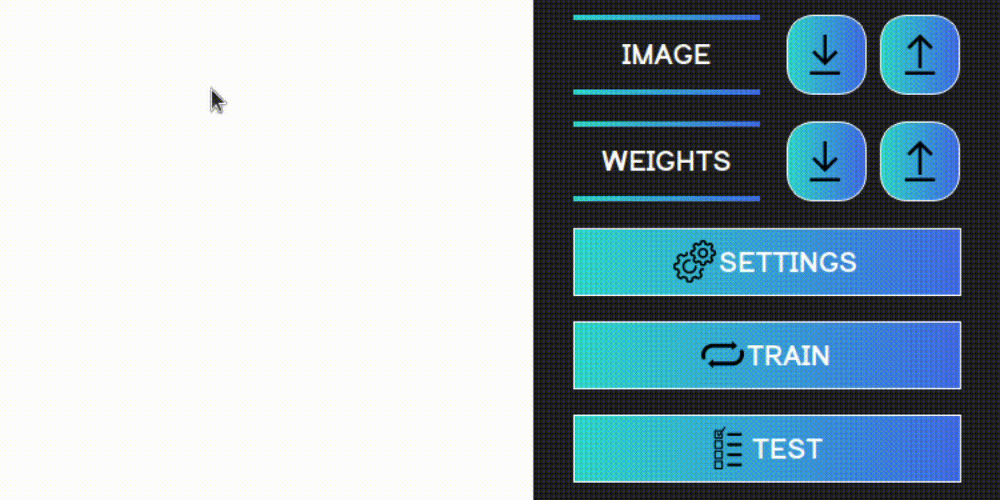
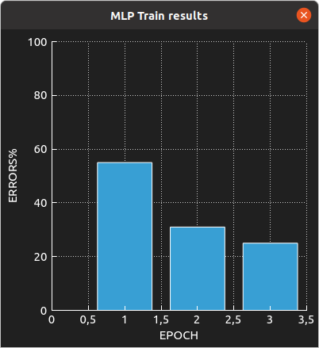
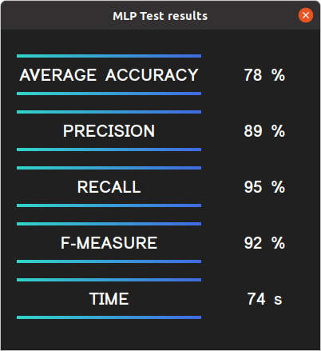
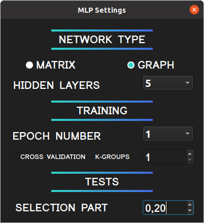

# MLP

## Content
This project is a neural network with several implementations that recognizes the letters of the Latin alphabet.
The neural network has two versions. The interface is intuitive and does not need special consideration.
1. Matrix neural network - all layers are represented as a matrix of weights.
2. Graph - each neuron is represented by a separate object that is connected with the rest.

For assembly you need:
1. `CMAKE 3.5` and higher
2. `QT 5.15.2` and higher

All data necessary for training and testing the neural network is in the archive `emnist/emnist-data.tar.gz`

## Working example

## Input data
In order for the neural network to be able to determine the letters in the drawn or downloaded image, it is necessary either to train
neural network, or load ready-made weights.
1. The image is drawn on the left side of the screen on a white canvas with the help of LMB, in order to erase
   drawn image - click RMB. As you draw, the neural network will predict the letter you have drawn.
   Further, this drawn image can be saved using the `↓` button to the directory of your choice.
2. You can upload an image using the `↑` button, after that it will appear on the canvas on the left side,
   where it can be edited.

## Education

In order for the neural network to be able to determine the letter, it is necessary to train it, or load ready-made weights.

1. Training is launched on the `TRAIN` button in a separate thread, with parameters from the settings (by default, this is a classic
training a matrix neural network with two hidden layers and one training epoch), you can set the settings yourself,
more on this later. After training, a graph will be opened showing the percentage of the neural network error at each of the training epochs.
If you wish, you can save the received weights on the `↓` button to the directory of your choice.
2. You can also load ready-made weights using the `↑` button. The user himself must select the correct weights
   for any type of network.

## Tests

After the neural network has been trained or the weights have been loaded, you can run tests on the specified sample
(from 0 to 1, in case of 0 - there is no test sample, tests are not run, in case of 1 - test sample is 100%)
over this neural network.
By clicking on the `TEST` button, the test module will be launched in a separate thread, and a window will open with all the main
metrics.
Namely:
1. Average accuracy (%)
2. Precision (%)
3. Recall (%)
4. F-measure (%)
5. Time (sec)

The input test data must also be selected correctly by the user.

## Settings

Settings open on the `SETTINGS` button, you can configure them:
1. Type of neural network, graph or matrix. `MATRIX` or `GRAPH`.
2. The number of hidden layers. `2-5`.
3. Number of epochs to train (if cross-validation is disabled). `1-5`.
4. Availability of cross-validation. `TRUE` or `FALSE`
5. Number of k-groups (if cross-validation is enabled). `1-10`.
6. Test sample. `0-1`.

The work was completed by: Savin Anton (telvina), Andrey Degtyarev (sreanna).